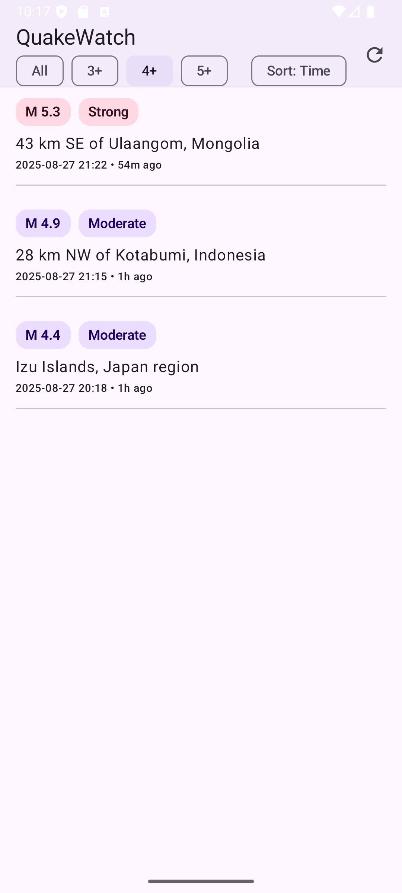
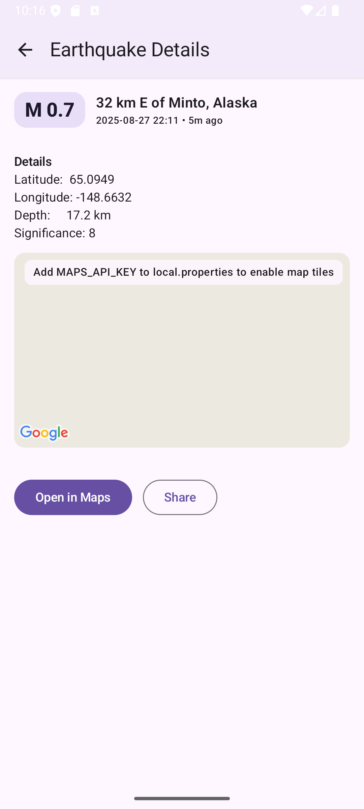

# QuakeWatch (Android)

A tiny, modern Android app that lists recent earthquakes from the **USGS Earthquake API**, with a clean **Jetpack Compose** UI, **Hilt** DI, and a native **detail screen** (map, chips, share, open-in-maps). Built to be demo-friendly: secrets stay out of git; refreshes don’t blank the screen; errors are graceful.

---

## Features

- Recent quakes list (LazyColumn) with:
    - Magnitude **chip** + readable **severity** chip (Minor/Light/Moderate/Strong/Major/Great)
    - Place title
    - Time (absolute + **relative** e.g., “12m ago”)
- **Filter chips** (pinned in the TopAppBar): All / 3+ / 4+ / 5+
- **Sort toggle**: Time (newest) or Magnitude (strongest)
- **Pull-to-refresh** (Material 3 `PullToRefreshBox`) and toolbar refresh icon
- **Non-blocking refresh polish**: list stays visible while refreshing; old data preserved on failure
- **Detail screen**:
    - Large magnitude chip, time, severity, optional **Alert/MMI/CDI/Tsunami** chips
    - Native **Google Map** (Compose) with marker at epicenter
    - Buttons: **Open in Maps** (geo: URI) and **Share**
- Lightweight networking with Retrofit + Moshi + OkHttp, polite `User-Agent`
- Clean architecture: ViewModel (StateFlow) → Repository → API

---

## Tech Stack

- **Kotlin** 2.2.10 (JDK 17)
- **AGP** 8.12.1, **Gradle** 8.13
- **Compose** (BOM `2024.10.00`), Compose Compiler `2.2.10`
- **Material 3**
- **Hilt** 2.57.1 (kapt)
- **Retrofit** + **Moshi** + **OkHttp**
- **Maps Compose** `com.google.maps.android:maps-compose:6.7.2`

---

---

## Screenshots





---

## Getting Started

### Requirements
- Android Studio (Giraffe+ recommended)
- JDK 17
- Android device/emulator (API 24+)

### 1) Clone
```bash
git clone <your-repo-url>
cd QuakeWatchKot
```

### 2) Local secrets (git-ignored)
Create/edit **`local.properties`** in the project root:

```
MAPS_API_KEY=YOUR_GOOGLE_MAPS_ANDROID_SDK_KEY
CONTACT_EMAIL=you@example.com
```

> `local.properties` is already ignored by git. The app builds without a key, but shows a friendly hint over the map until you set one.

### 3) Build config plumbing (already in the repo)

**`app/build.gradle.kts`** – `defaultConfig` & features:
```kotlin
android {
    // ...

    defaultConfig {
        applicationId = "com.example.quakewatch"
        minSdk = 24
        targetSdk = 34
        versionCode = 1
        versionName = "1.0"

        // Google Maps key from local.properties (or empty if missing)
        val mapsKey: String = providers.gradleProperty("MAPS_API_KEY").orNull ?: ""
        resValue("string", "google_maps_key", mapsKey)

        // Contact email from local.properties → BuildConfig.CONTACT_EMAIL
        val contactEmail: String = providers.gradleProperty("CONTACT_EMAIL").orNull ?: ""
        buildConfigField("String", "CONTACT_EMAIL", ""$contactEmail"")
    }

    buildFeatures {
        compose = true
        buildConfig = true   // required for BuildConfig.CONTACT_EMAIL
    }
}
```

**Manifest** – inject key into Google Maps SDK:
```xml
<!-- app/src/main/AndroidManifest.xml -->
<manifest ...>
    <!-- Required for USGS + Maps -->
    <uses-permission android:name="android.permission.INTERNET" />
    <application ...>
        <meta-data
            android:name="com.google.android.geo.API_KEY"
            android:value="@string/google_maps_key" />
    </application>
</manifest>
```

### 4) Run
From Android Studio or CLI:
```bash
# macOS example with system JDK 17:
JAVA_HOME="$(/usr/libexec/java_home -v 17)" ./gradlew clean assembleDebug
```

Install the APK or run from Android Studio.

---

## Architecture & Data Flow

```
UsgsViewModel (StateFlow<UiState>)  <-- Hilt injects QuakeRepository
          |         ^
          v         |
     QuakeRepository (interface)
          |
          v
  QuakeRepositoryImpl  -- Retrofit UsgsApi (Moshi) --> USGS API
```

- **UiState**
    - `Loading` – shown only on *first* load
    - `Success(quakes, refreshing)` – main screen; quick refresh toggles `refreshing`
    - `Error(message)` – on cold start only (Retry button available)
- **Refresh polish**
    - On pull/toolbar refresh, we keep showing the list (`Success(refreshing=true)`).
    - If fetch fails, we keep the old data and stop the spinner.
- **Selection**
    - `UsgsViewModel.selected` toggles between list and detail composables (no Nav component needed for this demo).

---

## Networking & API

- USGS endpoint: `GET fdsnws/event/1/query?format=geojson&orderby=time&limit=N`
- Models:
    - `UsgsResponse { metadata, features[] }`
    - `Feature { id, properties, geometry }`
    - `Properties { mag, place, time, alert?, tsunami?, cdi?, mmi?, felt?, sig? }`
    - `Geometry { coordinates = [lon, lat, depthKm] }`
    - Domain `Earthquake` maps the above into app-friendly fields
- OkHttp:
    - Logs BASIC requests
    - Adds a **polite User-Agent** with app/version + contact + device info
    - 10s connect/read/write timeouts

---

## UI Details

- **List row** (`EarthquakeRow`):
    - Line 1: magnitude chip + severity chip
    - Line 2: title (2 lines, ellipsize)
    - Line 3: `yyyy-MM-dd HH:mm • 12m ago`
- **Filters** pinned in TopAppBar:
    - All / 3+ / 4+ / 5+
    - Sort toggle chip: Time ↔ Mag
- **Pull-to-refresh**:
    - Material 3 `PullToRefreshBox` + toolbar refresh icon
- **Detail screen**:
    - Large magnitude chip, alert/MMI/CDI/tsunami chips
    - Map (Maps Compose) with marker
    - Actions: Open in Maps (geo:) and Share

---

## 🧪 Unit Tests (JVM only)

This project includes a compact, production-style unit test setup for a Kotlin/Compose/Hilt/Retrofit app, designed to run fast **without** an emulator or Robolectric.

---

## 1) Requirements

- **JDK 17** (required by the Android Gradle Plugin)
- **Gradle wrapper**: use `./gradlew` (do not install Gradle globally)

```bash
# macOS example
export JAVA_HOME="$("/usr/libexec/java_home" -v 17)"
```

---

## 2) Run all unit tests

```bash
./gradlew test
```

- HTML report: **app/build/reports/tests/testDebugUnitTest/index.html**
- These are **local unit tests** under `app/src/test` (pure JVM; no instrumentation).

---

## 3) Fast feedback recipes

```bash
# run only debug unit tests
./gradlew testDebugUnitTest

# re-run on changes (watch mode)
./gradlew test --continuous

# run a single class
./gradlew test --tests "*UsgsViewModelTest"

# run a single method
./gradlew test --tests "*UsgsViewModelTest.refresh_firstLoad_emits_Loading_then_Success_emptyList"

# add logs
./gradlew test -i --stacktrace
```

---

## 4) Project test layout

```
app/
  src/
    test/
      java/
        com/example/quakewatch/
          json/                # Moshi parsing tests
          repo/                # Repository + MockWebServer tests
          ui/util/             # Pure JVM utilities (time formatting)
          vm/                  # ViewModel + Turbine tests
          testing/             # Test infra (MainDispatcherRule, etc.)
      resources/
        fixtures/
          usgs_one_quake.json  # Realistic USGS GeoJSON sample
```

---

## 5) Test stack

Already included via `app/build.gradle.kts`:
- **JUnit 4** + **Truth**
- **kotlinx-coroutines-test** (+ `MainDispatcherRule`)
- **Turbine** for `StateFlow` assertions
- **MockWebServer** (+ Retrofit + Moshi)
- **MockK** for repository/ViewModel mocking
- **Moshi (reflection)** for tests → **no kapt/codegen** needed

Additions you should see in `dependencies { }`:

```kotlin
testImplementation("junit:junit:4.13.2")
testImplementation("com.google.truth:truth:1.4.4")
testImplementation("org.jetbrains.kotlinx:kotlinx-coroutines-test:1.8.1")
testImplementation("app.cash.turbine:turbine:1.0.0")
testImplementation("com.squareup.okhttp3:mockwebserver:4.12.0")
testImplementation("io.mockk:mockk:1.13.12")

// Moshi (reflection) – avoids kapt in tests
testImplementation("com.squareup.moshi:moshi:1.15.1")
testImplementation("com.squareup.moshi:moshi-kotlin:1.15.1")
```

And in `android { }`:

```kotlin
testOptions {
    unitTests.isReturnDefaultValues = true
}
```

---

## 6) What’s covered

- **Moshi parsing** of a real USGS GeoJSON fixture
- **Repository** test: Retrofit ↔ Moshi ↔ MockWebServer → domain mapping assertions
- **ViewModel** tests:
  - first-load **Loading → Success**
  - **Loading → Error** path
  - **Refresh** tolerance (either `Loading → Success` or `Success(refreshing=true) → Success(refreshing=false)`)
- **Utility** tests (time formatting) – deterministic with pinned timezone

---

## 7) Common gotchas

- **“Fixture not found”**: ensure files live under `app/src/test/resources/...` and are read via the classloader.
- **Timezone drift**: tests that format dates pin default TZ to UTC in `@Before`, restore in `@After`.
- **`ExperimentalCoroutinesApi` warnings**: `@OptIn(ExperimentalCoroutinesApi::class)` is applied in `MainDispatcherRule`.
- **Hilt/kapt warnings** in unit tests: safe to ignore for plain JVM tests—we do not run Robolectric here.
- **MockWebServer port conflicts**: rare; if you hit one, re-run. Tests call `server.shutdown()` in `@After`.

---

## 8) Minimal CI (GitHub Actions)

Create **.github/workflows/tests.yml**:

```yaml
name: tests

on:
  push:
  pull_request:

jobs:
  unit-tests:
    runs-on: ubuntu-latest
    steps:
      - uses: actions/checkout@v4
      - uses: actions/setup-java@v4
        with:
          distribution: temurin
          java-version: '17'
          cache: 'gradle'
      - name: Run unit tests
        run: ./gradlew test --no-daemon
      - name: Archive HTML test report
        if: always()
        uses: actions/upload-artifact@v4
        with:
          name: test-report
          path: app/build/reports/tests/testDebugUnitTest
```

---

## 9) Quick smoke

```bash
# everything
./gradlew clean test

# only repo + VM tests
./gradlew test --tests "*QuakeRepositoryImplTest" --tests "*UsgsViewModelTest"
```

That’s it—set `JAVA_HOME` to 17, `./gradlew test`, and open the HTML report.

---

## Common Troubleshooting

- **“defaultConfig contains custom BuildConfig fields, but the feature is disabled.”**
  Add:
  ```kotlin
  buildFeatures { buildConfig = true }
  ```

- **Missing Google Maps tiles / “Add MAPS_API_KEY…” overlay**
  Set `MAPS_API_KEY` in `local.properties`. The overlay is a friendly hint and disappears once a key is present.

- **Experimental API warnings**
  We opt-in to `@OptIn(ExperimentalMaterial3Api::class)` for `TopAppBar`/`PullToRefreshBox`.

- **Unresolved `dp` / `width` / `padding`**
  Ensure proper imports:
  ```kotlin
  import androidx.compose.ui.unit.dp
  import androidx.compose.foundation.layout.width
  import androidx.compose.foundation.layout.padding
  ```

- **Pull-to-refresh artifact not found**
  We use **Material 3 PullToRefresh** (`material3.pulltorefresh`) built-in — **do not** add `androidx.compose.material:material-pull-refresh`.

- **`stickyHeader` unresolved**
  We no longer use it (filters are pinned in the TopAppBar). If you reintroduce it, add the foundation artifact and opt-in to `ExperimentalFoundationApi`.

- **Packaging warning**
  ```
  Unable to strip ... libandroidx.graphics.path.so
  ```
  Harmless; safe to ignore for debug builds.

---

## Privacy & Permissions

- **Permissions**: INTERNET only.
- **Data**: Calls USGS API; no personal data collected.
- **Secrets**: Kept out of git via `local.properties` → `resValue` / `buildConfigField`.

---

## Roadmap / Ideas

- Persist filters/sort with **DataStore**
- Paging (“load more”) & on-scroll fetch
- Offline cache with Room or OkHttp cache
- Unit tests with MockWebServer
- Earthquake details: PGA/PGV/ShakeMap overlays, region grouping
- Theming polish, dynamic color, tablet layout

---

## Acknowledgements

- **USGS Earthquake API** – data source
- **Google Maps** – native map (Compose wrapper)
- **AndroidX** – Jetpack Compose & Material 3

---

## License

Choose your license (e.g., MIT/Apache-2.0) and add it here.

---

### Quick Commands

```bash
# Clean + build debug
JAVA_HOME="$(/usr/libexec/java_home -v 17)" ./gradlew clean assembleDebug

# Install on connected device
./gradlew installDebug
```
